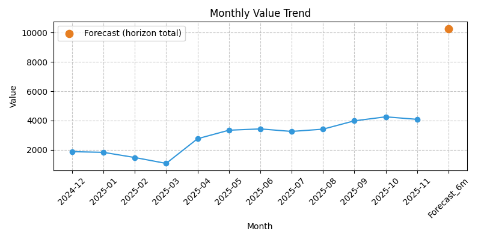
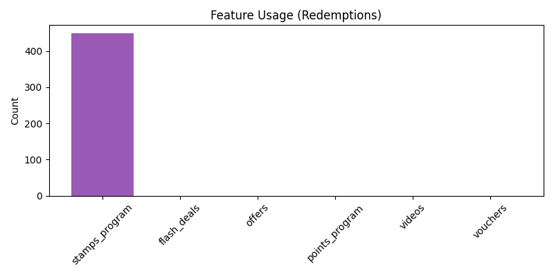

# Monthly Merchant Analytics Report

**Merchant:** Sweet Spot Cafe  (ID: 37623)  
**Report Date:** 2025-11-30  
**Report Period:** 2025-11  
**Loyalty Type:** Free Loyalty - stamps

**Merchant Since:** October 15, 2024

---

## Executive Summary

- **Program Health**: ✅ Healthy — churn rate 9.46%
- **Net Attributed Value**: 4085.94 BD (4579.84 BD gross, 493.9 BD redemption costs)
- **Customer Status**: 1237 Active (53.9%), 221 At Risk (9.6%), 839 Churned (36.5%)
- **Focus This Month**: 221 At-Risk customers need re-engagement; 123 newly churned

---

## Monthly Loyalty Value

**What decision can be made from this?** Budget reward costs for next month and assess if redemption rate is sustainable relative to gross value.

- **Gross Attributed Value**: 4579.84 BD  
  *Attributed sum of in-scope purchase-linked events. Includes receipt amounts when present; may include proxy amounts when receipt is missing.*

- **Redemption Costs**: 493.9 BD  
  *Value of rewards claimed (points redeemed, cash redeemed)*

- **Net Attributed Value (NOT profit)**: 4085.94 BD  
  *Gross attributed value minus redemption costs. Does not include COGS, overhead, taxes, or payment fees.*
  *Note: "Net Attributed Value" is the same as "CLTV (month)" — both represent program-linked activity after reward costs.*

### Stamp Receipt vs Proxy (Transparency)

- **Stamp collect events (month)**: 2652
- **Stamp collect events using proxy**: 0
- **Proxy event ratio**: 0% (all receipt-based)
- **Stamp value from receipts**: 4579.840 BD
- **Stamp value from proxy**: 0.000 BD
- **Proxy value ratio**: 0% (all receipt-based)

### 6-Month Forecast (Illustrative)

**What decision can be made from this?** Plan reward budget and set expectations for program value over the next 6 months. **NOT a financial guarantee.**

- **Projected Gross Value**: 11682 BD
- **Projected Net Value**: 10280 BD

- **Scenario band (illustrative)**:
  - Conservative (−30%): 8177 BD gross, 7196 BD net
  - Base: 11682 BD gross, 10280 BD net
  - Optimistic (+20%): 14018 BD gross, 12336 BD net
  *Scenario bands are heuristic stress tests, not statistical confidence intervals. Internal statistical confidence intervals exist but are not surfaced in this report.*

**Method:** churn-adjusted_run_rate (non-cohort)  
**Details:** survival_adjusted using 6-month rolling average with missing months treated as 0; churn adjustment uses the current-month churn rate and does not include a reactivation model  
*Forecast excludes reactivation behavior; values may understate upside if dormant users return.*
**Discounting:** 10.0% annual
*Forecast values are point estimates; uncertainty bands will be introduced in a future release.*

⚠️ **When forecasts are most likely wrong**: During seasonal changes, after major marketing campaigns, or if customer behavior patterns shift significantly from the 6-month lookback period.

### How to Interpret These Metrics

✅ **Net Attributed Value** shows program-linked activity after accounting for reward costs.  
❌ **NOT** profit and **NOT** incremental impact — it does not prove the loyalty program caused this value.  
📊 **Use for:** Budgeting reward costs, monitoring engagement, comparing directionally across months.  
⚠️ **Limitations:**
- Stamp value: 100% receipt-based this month
- Does not capture non-transactional value (brand loyalty, referrals)
- Forecast is directional only, not a financial guarantee

**Trend chart note:** Last 12 calendar months ending at the selected month; missing months are plotted as **0**.

---

## Customer Segmentation

**What decision can be made from this?** Prioritize re-engagement campaigns: target At-Risk customers immediately, investigate why Active customers moved to At-Risk, and plan win-back campaigns for newly churned.

### Status distribution (must reconcile)
**Universe mode:** `qualifying_events_only`  
**Active + At Risk + Churned:** 1237 + 221 + 839 = 2297  
**Reconciliation:** PASS

**Status Definitions:**
- **Active**: ≤60 days since last qualifying activity
- **At Risk**: 61–90 days since last qualifying activity  
- **Churned**: >90 days since last qualifying activity

### Status transition matrix (2025-10 → 2025-11)

| Prev \ Curr | Active | At Risk | Churned | Total |
|---|---:|---:|---:|---:|
| Active | 929 | 221 | 0 | 1150 |
| At Risk | 27 | 0 | 123 | 150 |
| Churned | 281 | 0 | 716 | 997 |

| **Total** | 1237 | 221 | 839 | 2297 |

---

## Top Customers (by 6m forecast, if available)

**What decision can be made from this?** Identify VIP customers for retention programs and assess revenue concentration risk.

| Rank | User ID | Status | Days Since Activity | CLTV (month) | Forecast (6m) |
|---:|---:|---|---:|---:|---:|
| 1 | L4XN4ZB | Active | 0 | 45.2 | 159.918 |
| 2 | LZTTE1W | Active | 10 | 14.9 | 133.593 |
| 3 | L1CYGAZ | Active | 1 | 21.7 | 130.828 |
| 4 | LRKFL6G | Active | 0 | 26.0 | 122.245 |
| 5 | LE6NRE6 | Active | 0 | 28.7 | 119.447 |
| 6 | L74UNDI | Active | 0 | 52.3 | 118.516 |
| 7 | L0AJC4V | Active | 0 | 30.2 | 101.494 |
| 8 | LSN0HKU | Active | 1 | 36.3 | 95.879 |
| 9 | LKNSRW2 | Active | 1 | 33.0 | 91.604 |
| 10 | LR9Q1QS | Active | 1 | 2.0 | 87.288 |

### At-Risk Customers (priority list)

*Note: These users generated no qualifying value in the current month; forecast is zero by design.*

| User ID | Days Since Activity | CLTV (month) | Forecast (6m) |
|---:|---:|---:|---:|
| L01BJPJ | 88 | 0.0 | 0.0 |
| L0EFWZ1 | 81 | 0.0 | 0.0 |
| L0XVLDT | 80 | 0.0 | 0.0 |
| L0Y07SH | 89 | 0.0 | 0.0 |
| L132MJ2 | 70 | 0.0 | 0.0 |
| L1BZXXC | 88 | 0.0 | 0.0 |
| L1KEE0V | 66 | 0.0 | 0.0 |
| L1KEKFD | 75 | 0.0 | 0.0 |
| L1Q1FF8 | 70 | 0.0 | 0.0 |
| L1ZGL1O | 63 | 0.0 | 0.0 |

---

## Transaction Activity (summary)

> **Note:** Transaction activity summaries show customer behavior *as of report month-end* (2025-11).
> All dates and metrics above reflect only activity within or prior to the selected report period.

### L4XN4ZB

Transaction Activity:
- First transaction: Oct 17, 2024
- Most recent transaction: Nov 30, 2025
- Last transaction details: Nov 30, 2025 07:12 — collect_stamp (value=3.70)
- Transaction pattern: typically 5+ transactions per week
- Average transaction value: ~1.65 BD
- Current status: Active and transacting regularly

### L132MJ2

Transaction Activity:
- First transaction: Sep 21, 2025
- Most recent transaction: Sep 21, 2025
- Last transaction details: Sep 21, 2025 16:12 — collect_stamp (value=1.00)
- Transaction pattern: no recent transactions
- Average transaction value: ~1.00 BD
- Current status: At Risk — needs re-engagement

### LZTTE1W

Transaction Activity:
- First transaction: Oct 16, 2024
- Most recent transaction: Nov 20, 2025
- Last transaction details: Nov 20, 2025 08:37 — collect_stamp (value=2.30)
- Transaction pattern: typically 3–4 transactions per week
- Average transaction value: ~2.40 BD
- Current status: Active and transacting regularly

### L1BZXXC

Transaction Activity:
- First transaction: Aug 29, 2025
- Most recent transaction: Sep 03, 2025
- Last transaction details: Sep 03, 2025 22:09 — collect_stamp (value=1.40)
- Transaction pattern: no recent transactions
- Average transaction value: ~1.40 BD
- Current status: At Risk — needs re-engagement

### L01BJPJ

Transaction Activity:
- First transaction: Oct 19, 2024
- Most recent transaction: Sep 03, 2025
- Last transaction details: Sep 03, 2025 19:34 — redeem_stamp (value=-1.10)
- Transaction pattern: no recent transactions
- Average transaction value: ~1.40 BD
- Current status: At Risk — needs re-engagement

### LR9Q1QS

Transaction Activity:
- First transaction: Oct 16, 2024
- Most recent transaction: Nov 29, 2025
- Last transaction details: Nov 29, 2025 11:50 — collect_stamp (value=1.00)
- Transaction pattern: typically 3–4 transactions per week
- Average transaction value: ~1.32 BD
- Current status: Active and transacting regularly

### L74UNDI

Transaction Activity:
- First transaction: Feb 19, 2025
- Most recent transaction: Nov 30, 2025
- Last transaction details: Nov 30, 2025 22:08 — collect_stamp (value=2.00)
- Transaction pattern: typically 5+ transactions per week
- Average transaction value: ~1.96 BD
- Current status: Active and transacting regularly

### L0XVLDT

Transaction Activity:
- First transaction: Sep 11, 2025
- Most recent transaction: Sep 11, 2025
- Last transaction details: Sep 11, 2025 08:56 — collect_stamp (value=2.50)
- Transaction pattern: no recent transactions
- Average transaction value: ~2.50 BD
- Current status: At Risk — needs re-engagement

### LRKFL6G

Transaction Activity:
- First transaction: Oct 17, 2024
- Most recent transaction: Nov 30, 2025
- Last transaction details: Nov 30, 2025 23:05 — collect_stamp (value=1.00)
- Transaction pattern: typically 5+ transactions per week
- Average transaction value: ~2.45 BD
- Current status: Active and transacting regularly

### LE6NRE6

Transaction Activity:
- First transaction: Oct 22, 2024
- Most recent transaction: Nov 30, 2025
- Last transaction details: Nov 30, 2025 11:34 — collect_stamp (value=1.00)
- Transaction pattern: typically 5+ transactions per week
- Average transaction value: ~2.00 BD
- Current status: Active and transacting regularly

### LKNSRW2

Transaction Activity:
- First transaction: Oct 21, 2024
- Most recent transaction: Nov 29, 2025
- Last transaction details: Nov 29, 2025 15:47 — collect_stamp (value=1.00)
- Transaction pattern: typically 5+ transactions per week
- Average transaction value: ~1.36 BD
- Current status: Active and transacting regularly

### L0Y07SH

Transaction Activity:
- First transaction: Nov 06, 2024
- Most recent transaction: Sep 02, 2025
- Last transaction details: Sep 02, 2025 06:36 — redeem_stamp (value=-1.10)
- Transaction pattern: no recent transactions
- Average transaction value: —
- Current status: At Risk — needs re-engagement

### L1CYGAZ

Transaction Activity:
- First transaction: Jan 29, 2025
- Most recent transaction: Nov 29, 2025
- Last transaction details: Nov 29, 2025 16:45 — collect_stamp (value=1.70)
- Transaction pattern: typically 3–4 transactions per week
- Average transaction value: ~1.81 BD
- Current status: Active and transacting regularly

### L1KEKFD

Transaction Activity:
- First transaction: Apr 04, 2025
- Most recent transaction: Sep 16, 2025
- Last transaction details: Sep 16, 2025 18:07 — redeem_stamp (value=-1.10)
- Transaction pattern: no recent transactions
- Average transaction value: ~1.80 BD
- Current status: At Risk — needs re-engagement

### L0EFWZ1

Transaction Activity:
- First transaction: May 03, 2025
- Most recent transaction: Sep 10, 2025
- Last transaction details: Sep 10, 2025 22:56 — collect_stamp (value=2.00)
- Transaction pattern: no recent transactions
- Average transaction value: ~1.60 BD
- Current status: At Risk — needs re-engagement

### LSN0HKU

Transaction Activity:
- First transaction: May 25, 2025
- Most recent transaction: Nov 29, 2025
- Last transaction details: Nov 29, 2025 08:16 — collect_stamp (value=1.80)
- Transaction pattern: typically 3–4 transactions per week
- Average transaction value: ~3.49 BD
- Current status: Active and transacting regularly

### L1KEE0V

Transaction Activity:
- First transaction: May 29, 2025
- Most recent transaction: Sep 25, 2025
- Last transaction details: Sep 25, 2025 12:09 — collect_stamp (value=1.40)
- Transaction pattern: no recent transactions
- Average transaction value: ~2.60 BD
- Current status: At Risk — needs re-engagement

### L0AJC4V

Transaction Activity:
- First transaction: Jul 10, 2025
- Most recent transaction: Nov 30, 2025
- Last transaction details: Nov 30, 2025 10:35 — collect_stamp (value=4.40)
- Transaction pattern: typically 3–4 transactions per week
- Average transaction value: ~2.37 BD
- Current status: Active and transacting regularly

### L1Q1FF8

Transaction Activity:
- First transaction: Sep 21, 2025
- Most recent transaction: Sep 21, 2025
- Last transaction details: Sep 21, 2025 13:52 — collect_stamp (value=0.80)
- Transaction pattern: no recent transactions
- Average transaction value: ~0.80 BD
- Current status: At Risk — needs re-engagement

### L1ZGL1O

Transaction Activity:
- First transaction: Sep 23, 2025
- Most recent transaction: Sep 28, 2025
- Last transaction details: Sep 28, 2025 20:16 — collect_stamp (value=1.80)
- Transaction pattern: no recent transactions
- Average transaction value: ~1.70 BD
- Current status: At Risk — needs re-engagement

---

## Staff Activity Breakdown

**What decision can be made from this?** Allocate staff training resources and identify top performers for recognition or process replication.

This section shows staff performance and transaction activity for 2025-11.

- **أبو عبيدة**
  - Collect events: 2005 stamps | Value: 3394.35 BD
  - Redeem events: 340 stamps | Cost: 374.00 BD

- **سيد جعفر**
  - Collect events: 335 stamps | Value: 604.50 BD
  - Redeem events: 58 stamps | Cost: 63.80 BD

- **عبدلله البارباري**
  - Collect events: 305 stamps | Value: 572.45 BD
  - Redeem events: 51 stamps | Cost: 56.10 BD

⚠️ **Risk Flag — Staff Dependency**: أبو عبيدة handles 74.3% of collection value. Cross-train staff to reduce single-point dependency.

### Summary Totals
- **Total collection transactions for 2025-11**: 2652
- **Total redemption transactions for 2025-11**: 449

**Note:** Staff collection totals can differ slightly from Gross Attributed Value due to event-type scope (qualifying events only), receipt vs proxy handling, and month-boundary timing.

---

## Retention Recommendations Using Loyale Solutions (actionable)

### [HIGH] At-Risk Customers
**Who:** 221 customers (61–90 days since last qualifying activity)  
**What to do:**
- Flash Deals: time-limited offers (24–48h) to create urgency
- Push Notifications: “We miss you — an exclusive offer is waiting”
- Promotional Codes: single-use comeback codes (e.g., `COMEBACK15`)
- Points Boost / Credit Boost: double points on next visit
- Personalized Vouchers / Offers: based on prior purchase behavior

### [HIGH] Churned Customers
**Who:** 839 customers (> 90 days)  
**What to do:**
- “Welcome Back” campaign with strong incentive via Offers/Vouchers
- Video Offers to reintroduce the program and drive a first return visit
- Survey / feedback prompt to learn churn drivers

### [LOW] Active Customers
**Who:** 1237 customers (≤ 60 days)  
**What to do:**
- Loyalty milestones + surprise rewards (points boosts, appreciation vouchers)
- Referrals / group mechanics where applicable
- Tier progress nudges (if program supports tiers)

---

## Feature Performance

**Note:** Redemption rates show engagement but **cannot prove ROI** without control groups. Use to identify popular features, not to calculate attributed value impact.

*Enabled indicates feature availability, not usage. Disabled features (enabled = 0) are shown for completeness.*

**Metric Definitions:**
- **Redemption Rate:** (Redeemed Count) ÷ (Created Count)  
- **Correlated Attributed Value:** Net attributed value from users who redeemed this feature (correlation, not causation; selection bias)

**Footnote:** Users are selected based on redemption behavior; values are not comparable across features and do not estimate ROI.

| feature_code | enabled | enabled_method | created | redeemed | redemption_rate | active_users | correlated_attributed_value | notes |
|---|---:|---|---:|---:|---:|---:|---:|---|
| flash_deals | 1 | inferred_from_flash_deal_records | 0 | 0 | NA | 0 | — | influenced_value_is_net_attributed_value_for_users_who_redeemed |
| offers | 0 | inferred_from_offer_records | 0 | 0 | — | 0 | — | influenced_value_is_net_attributed_value_for_users_who_redeemed |
| points_program | 0 | merchant.cardType | 0 | 0 | — | 0 | — | created_count_not_available_for_program_points; influenced_value_is_net_attributed_value_for_users_who_redeemed |
| stamps_program | 1 | merchant.cardType | 2652 | 449 | 16.93% | 325 | 2334.71 | created_count_is_collect_stamp_events; influenced_value_is_net_attributed_value_for_users_who_redeemed |
| videos | 0 | inferred_from_promotional_video_records | 0 | 0 | — | 0 | — | influenced_value_not_available_no_attribution_fields |
| vouchers | 0 | inferred_from_voucher_records | 0 | 0 | — | 0 | — | influenced_value_not_available_no_attribution_fields |

---

## Definitions used (runtime config)

| Key | Value |
|---|---|
| month | 2025-11 |
| timezone_mode | fixed_tz |
| fixed_timezone | Asia/Bahrain |
| universe_mode | qualifying_events_only |
| qualifying_event_types | ['collect_points', 'collect_stamp', 'purchase_voucher', 'redeem_points', 'redeem_stamp', 'redeem_offer', 'redeem_flash'] |
| at_risk_inactive_days | 60 |
| churn_inactive_days | 90 |
| value_basis | revenue_amount |
| include_redemptions_in_value | False |
| points_to_currency_rate | None |
| stamp_event_value | 3.5019167 |
| forecast_horizon_months | 6 |
| forecast_method | survival_adjusted |
| lookback_months_for_run_rate | 6 |
| discount_rate_annual | 0.1 |

---

## Data Quality & Reconciliation

### Data quality summary

- **lookback_months_for_run_rate**: 6 (info) 

- **run_rate_estimator**: trimmed_mean_20 (info) 

- **tz_offset_hours**: 3 (info) — Timezone offset applied for fixed timezone Asia/Bahrain

- **events_in_scope_total**: 3101 (info) — All event_types in stg_activity_event within the month window (and merchant filter if applicable).

- **qualifying_events_in_scope**: 3101 (info) — Only event_type IN qualifying_event_types within the same window.

- **customers_classified**: 2297 (info) 

- **dup_source_events_in_scope**: 0 (pass) — Duplicate (source_table, source_id) rows within the month window.

- **dup_keys_merchant_customer_monthly_status**: 0 (pass) 

- **dup_keys_merchant_monthly_summary**: 0 (pass) 

- **dup_keys_merchant_feature_monthly_metrics**: 0 (pass) 

- **dup_keys_app_user_monthly_status**: 0 (pass) 

- **dup_keys_app_monthly_summary**: 0 (pass) 

- **recon_cltv_mart**: 4085.94 (info) 

- **recon_cltv_raw**: 4085.939991891384 (info) 

- **recon_delta_mart_minus_raw**: 8.108615929813823e-06 (pass) 

- **stamp_collect_events**: 2652 (info) 

- **stamp_collect_proxy_events**: 0 (info) 

- **stamp_proxy_event_ratio**: 0.000000 (pass) — Proxy used when receipt_amount is missing or non-positive. Threshold: < 0.01

- **stamp_collect_receipt_value**: 4579.840 (info) 

- **stamp_collect_proxy_value**: 0.000 (info) — Proxy value uses merchant_stamp_proxy.avg_bd_per_stamp when available; otherwise global stamp_event_value.

- **stamp_proxy_value_ratio**: 0.000000 (info) 

- **points_collect_events**: 0 (info) 

- **points_collect_proxy_events**: 0 (info) 

- **points_proxy_event_ratio**: NULL (pass) — Points use receipt_amount directly; events without receipt_amount are excluded from value calculation.

- **points_collect_receipt_value**: 0.000 (info) 

- **active_or_at_risk_last_activity_ts_null**: 0 (pass) — Active/At Risk users must have last_activity_ts

- **snapshot_last_activity_ts_after_month_end**: 0 (pass) — Snapshot integrity: last_activity_ts must be <= month_end_ts_utc

- **forecast_guardrail_violations**: 0 (pass) — At Risk/Churned users with 0 current-month gross value must not have positive forecast

- **merchant_collect_total_value**: 4579.840 (info) — Collect points + collect stamps (receipt/proxy) total

- **staff_collect_total_value**: 4579.840 (info) — Staff totals incl NULL staff bucket

- **staff_vs_collect_total_delta**: 0.000000 (pass) — Threshold: abs(delta) <= 0.01

### Event sources (top 3, in-scope)

- **user_collect_stamp**: 2652

- **user_redeem_stamp**: 449

### Reconciliation
- **CLTV (mart)**: 4085.94
- **Raw qualifying value (source-derived)**: 4085.939991891384
- **Delta (mart - raw)**: 8.108615929813823e-06
- **Expected reasons**:

  - excluded event types: non-qualifying events are not included in CLTV by definition

  - stamps proxy: if receipt_amount=0, stamp_event_value is used

  - timezone: month windows computed in fixed_timezone then converted to UTC; DB timestamps treated as UTC

