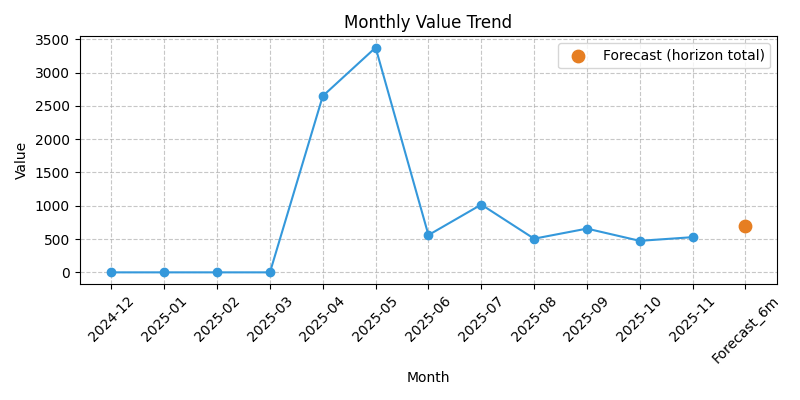
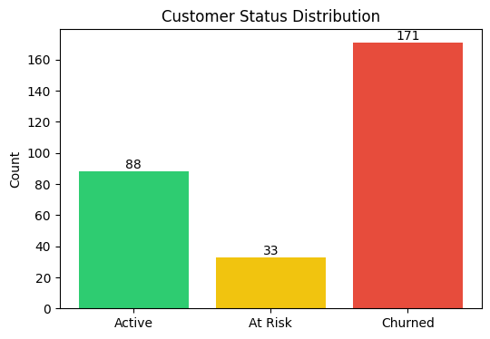

# Monthly Merchant Analytics Report

**Merchant:** Petal & Bean  (ID: 41999)  
**Report Date:** 2025-11-30  
**Report Period:** 2025-11  
**Loyalty Type:** Free Loyalty - points

**Merchant Since:** April 09, 2025

---

## Executive Summary

- **Program Health**: ⚠️ Critical — churn rate 27.17% exceeds 25.0% Churn at this level suggests declining engagement and should be addressed within the next 1–2 months to prevent further value erosion.
- **Net Attributed Value**: 528.315 BD (594.265 BD gross, 65.95 BD redemption costs)
- **Trend vs Last Month**: (no previous month data available)
- **Customer Status**: 88 Active (30.1%), 33 At Risk (11.3%), 171 Churned (58.6%)
- **Focus This Month**: 33 At-Risk customers need re-engagement; 25 newly churned

---

## Monthly Loyalty Value

**What decision can be made from this?** Budget reward costs for next month and assess if redemption rate is sustainable relative to gross value.

- **Gross Attributed Value**: 594.265 BD  
  *Attributed sum of in-scope purchase-linked events. Includes receipt amounts when present; may include proxy amounts when receipt is missing.*

- **Redemption Costs**: 65.95 BD  
  *Value of rewards claimed (points redeemed, cash redeemed)*

- **Net Attributed Value (NOT profit)**: 528.315 BD  
  *Gross attributed value minus redemption costs. Does not include COGS, overhead, taxes, or payment fees.*
  *Note: "Net Attributed Value" is the same as "CLTV (month)" — both represent program-linked activity after reward costs.*

  *Point values are converted to BD using the receipt-linked transaction value at the time of earning or redemption. No fixed points-to-currency rate is assumed.*

### Points Value Transparency

- **Points collect events (month)**: 180
- **Points value derived from receipts**: 100%
- **Proxy usage**: 0% (all receipt-based)

### 6-Month Forecast (Illustrative)

**What decision can be made from this?** Plan reward budget and set expectations for program value over the next 6 months. **NOT a financial guarantee.**

- **Projected Gross Value**: 769 BD
- **Projected Net Value**: 699 BD

- **Scenario band (illustrative)**:
  - Conservative (−30%): 538 BD gross, 489 BD net
  - Base: 769 BD gross, 699 BD net
  - Optimistic (+20%): 923 BD gross, 838 BD net
  *Scenario bands are heuristic stress tests, not statistical confidence intervals. Internal statistical confidence intervals exist but are not surfaced in this report.*

**Method:** churn-adjusted_run_rate (non-cohort)  
**Details:** survival_adjusted using 6-month rolling average with missing months treated as 0; churn adjustment uses the current-month churn rate and does not include a reactivation model  
*Forecast excludes reactivation behavior; values may understate upside if dormant users return.*
**Discounting:** 10.0% annual
*Forecast values are point estimates; uncertainty bands will be introduced in a future release.*

⚠️ **When forecasts are most likely wrong**: During seasonal changes, after major marketing campaigns, or if customer behavior patterns shift significantly from the 6-month lookback period.

### How to Interpret These Metrics

✅ **Net Attributed Value** shows program-linked activity after accounting for reward costs.  
❌ **NOT** profit and **NOT** incremental impact — it does not prove the loyalty program caused this value.  
📊 **Use for:** Budgeting reward costs, monitoring engagement, comparing directionally across months.  
⚠️ **Limitations:**

- Does not capture non-transactional value (brand loyalty, referrals)
- Forecast is directional only, not a financial guarantee

**Trend chart note:** Last 12 calendar months ending at the selected month; missing months are plotted as **0**.

---

## Customer Segmentation

**What decision can be made from this?** Prioritize re-engagement campaigns: target At-Risk customers immediately, investigate why Active customers moved to At-Risk, and plan win-back campaigns for newly churned.

### Status distribution (must reconcile)
**Universe mode:** `qualifying_events_only`  
**Active + At Risk + Churned:** 88 + 33 + 171 = 292  
**Reconciliation:** PASS

**Status Definitions:**
- **Active**: ≤60 days since last qualifying activity
- **At Risk**: 61–90 days since last qualifying activity  
- **Churned**: >90 days since last qualifying activity

⚠️ **Risk Flag — Churn Acceleration**: Monthly churn rate (27.17%) exceeds 25.0% — critical threshold. Immediate retention intervention required.

### Status transition matrix (2025-10 → 2025-11)

| Prev \ Curr | Active | At Risk | Churned | Total |
|---|---:|---:|---:|---:|
| Active | 59 | 33 | 0 | 92 |
| At Risk | 6 | 0 | 25 | 31 |
| Churned | 23 | 0 | 146 | 169 |

| **Total** | 88 | 33 | 171 | 292 |

---

## Top Customers (by 6m forecast, if available)

**What decision can be made from this?** Identify VIP customers for retention programs and assess revenue concentration risk.

| Rank | User ID | Status | Days Since Activity | CLTV (month) | Forecast (6m) |
|---:|---:|---|---:|---:|---:|
| 1 | LSMG0OF | Active | 5 | 29.25 | 57.484 |
| 2 | LTGMVTK | Active | 0 | 31.7 | 55.251 |
| 3 | LL3HD26 | Active | 0 | 36.95 | 51.972 |
| 4 | L0LX4MO | Active | 2 | 31.5 | 50.025 |
| 5 | LV5UT4X | Active | 1 | 3.8 | 46.184 |
| 6 | L2UXZE7 | Active | 1 | 11.9 | 37.206 |
| 7 | L4VAPE9 | Active | 21 | 11.4 | 25.638 |
| 8 | L071N0M | Active | 5 | 7.9 | 20.952 |
| 9 | LCLEMWX | Active | 17 | 5.8 | 20.055 |
| 10 | LXXS2NW | Active | 3 | 1.4 | 16.481 |

### At-Risk Customers (priority list)

*Note: These users generated no qualifying value in the current month; forecast is zero by design.*

| User ID | Days Since Activity | CLTV (month) | Forecast (6m) |
|---:|---:|---:|---:|
| L199H9F | 74 | 0.0 | 0.0 |
| L1CAKEH | 66 | 0.0 | 0.0 |
| L37WO82 | 64 | 0.0 | 0.0 |
| L4TF4T2 | 66 | 0.0 | 0.0 |
| L5WN4R3 | 81 | 0.0 | 0.0 |
| L60JUKI | 61 | 0.0 | 0.0 |
| L650O62 | 89 | 0.0 | 0.0 |
| L7RJI25 | 64 | 0.0 | 0.0 |
| L8MBL8X | 80 | 0.0 | 0.0 |
| L8N71EB | 74 | 0.0 | 0.0 |

---

## Transaction Activity (summary)

> **Note:** Transaction activity summaries show customer behavior *as of report month-end* (2025-11).
> All dates and metrics above reflect only activity within or prior to the selected report period.

### L199H9F

Transaction Activity:
- First transaction: Apr 27, 2025
- Most recent transaction: Sep 17, 2025
- Last transaction details: Sep 17, 2025 15:04 — collect_points (value=2.70, points=3)
- Transaction pattern: less than 1 transaction per week
- Average transaction value: ~2.70 BD
- Current status: At Risk — needs re-engagement

### L60JUKI

Transaction Activity:
- First transaction: Sep 30, 2025
- Most recent transaction: Sep 30, 2025
- Last transaction details: Sep 30, 2025 10:03 — collect_points (value=8.40, points=8)
- Transaction pattern: less than 1 transaction per week
- Average transaction value: ~8.40 BD
- Current status: At Risk — needs re-engagement

### L8N71EB

Transaction Activity:
- First transaction: Sep 17, 2025
- Most recent transaction: Sep 17, 2025
- Last transaction details: Sep 17, 2025 10:24 — collect_points (value=5.70, points=6)
- Transaction pattern: less than 1 transaction per week
- Average transaction value: ~5.70 BD
- Current status: At Risk — needs re-engagement

### LL3HD26

Transaction Activity:
- First transaction: Apr 10, 2025
- Most recent transaction: Nov 30, 2025
- Last transaction details: Nov 30, 2025 18:28 — collect_points (value=0.60, points=1)
- Transaction pattern: typically 3–4 transactions per week
- Average transaction value: ~2.17 BD
- Current status: Active and transacting regularly

### L8MBL8X

Transaction Activity:
- First transaction: Jul 08, 2025
- Most recent transaction: Sep 11, 2025
- Last transaction details: Sep 11, 2025 19:20 — collect_points (value=2.50, points=2)
- Transaction pattern: less than 1 transaction per week
- Average transaction value: ~2.50 BD
- Current status: At Risk — needs re-engagement

### L1CAKEH

Transaction Activity:
- First transaction: Jul 25, 2025
- Most recent transaction: Sep 25, 2025
- Last transaction details: Sep 25, 2025 21:50 — collect_points (value=5.70, points=6)
- Transaction pattern: less than 1 transaction per week
- Average transaction value: ~5.70 BD
- Current status: At Risk — needs re-engagement

### L4TF4T2

Transaction Activity:
- First transaction: Sep 25, 2025
- Most recent transaction: Sep 25, 2025
- Last transaction details: Sep 25, 2025 22:05 — collect_points (value=2.20, points=2)
- Transaction pattern: less than 1 transaction per week
- Average transaction value: ~2.20 BD
- Current status: At Risk — needs re-engagement

### LCLEMWX

Transaction Activity:
- First transaction: Apr 10, 2025
- Most recent transaction: Nov 13, 2025
- Last transaction details: Nov 13, 2025 16:52 — redeem_points (value=-7.05, points=58)
- Transaction pattern: typically 1–2 transactions per week
- Average transaction value: ~5.49 BD
- Current status: Active and transacting regularly

### LTGMVTK

Transaction Activity:
- First transaction: Apr 10, 2025
- Most recent transaction: Nov 30, 2025
- Last transaction details: Nov 30, 2025 15:34 — collect_points (value=2.10, points=2)
- Transaction pattern: typically 5+ transactions per week
- Average transaction value: ~2.48 BD
- Current status: Active and transacting regularly

### L0LX4MO

Transaction Activity:
- First transaction: Apr 11, 2025
- Most recent transaction: Nov 28, 2025
- Last transaction details: Nov 28, 2025 10:41 — collect_points (value=4.30, points=4)
- Transaction pattern: typically 3–4 transactions per week
- Average transaction value: ~3.16 BD
- Current status: Active and transacting regularly

### L2UXZE7

Transaction Activity:
- First transaction: Apr 17, 2025
- Most recent transaction: Nov 29, 2025
- Last transaction details: Nov 29, 2025 12:19 — collect_points (value=3.40, points=3)
- Transaction pattern: typically 1–2 transactions per week
- Average transaction value: ~2.85 BD
- Current status: Active and transacting regularly

### L071N0M

Transaction Activity:
- First transaction: Apr 19, 2025
- Most recent transaction: Nov 25, 2025
- Last transaction details: Nov 25, 2025 20:27 — collect_points (value=1.90, points=2)
- Transaction pattern: typically 1–2 transactions per week
- Average transaction value: ~3.59 BD
- Current status: Active with low recent transaction activity

### LSMG0OF

Transaction Activity:
- First transaction: Apr 19, 2025
- Most recent transaction: Nov 25, 2025
- Last transaction details: Nov 25, 2025 20:00 — collect_points (value=4.35, points=4)
- Transaction pattern: typically 1–2 transactions per week
- Average transaction value: ~5.25 BD
- Current status: Active and transacting regularly

### LXXS2NW

Transaction Activity:
- First transaction: Apr 21, 2025
- Most recent transaction: Nov 27, 2025
- Last transaction details: Nov 27, 2025 11:24 — redeem_points (value=-2.00, points=13)
- Transaction pattern: typically 1–2 transactions per week
- Average transaction value: ~2.18 BD
- Current status: Active and transacting regularly

### L650O62

Transaction Activity:
- First transaction: Apr 27, 2025
- Most recent transaction: Sep 02, 2025
- Last transaction details: Sep 02, 2025 21:38 — redeem_points (value=-1.20, points=12)
- Transaction pattern: less than 1 transaction per week
- Average transaction value: —
- Current status: At Risk — needs re-engagement

### L5WN4R3

Transaction Activity:
- First transaction: Jun 24, 2025
- Most recent transaction: Sep 10, 2025
- Last transaction details: Sep 10, 2025 19:49 — collect_points (value=3.40, points=3)
- Transaction pattern: less than 1 transaction per week
- Average transaction value: ~3.40 BD
- Current status: At Risk — needs re-engagement

### LV5UT4X

Transaction Activity:
- First transaction: Jul 04, 2025
- Most recent transaction: Nov 29, 2025
- Last transaction details: Nov 29, 2025 14:22 — collect_points (value=1.70, points=2)
- Transaction pattern: typically 3–4 transactions per week
- Average transaction value: ~2.21 BD
- Current status: Active and transacting regularly

### L37WO82

Transaction Activity:
- First transaction: Aug 16, 2025
- Most recent transaction: Sep 27, 2025
- Last transaction details: Sep 27, 2025 17:10 — collect_points (value=2.50, points=2)
- Transaction pattern: less than 1 transaction per week
- Average transaction value: ~2.50 BD
- Current status: At Risk — needs re-engagement

### L4VAPE9

Transaction Activity:
- First transaction: Jul 14, 2025
- Most recent transaction: Nov 09, 2025
- Last transaction details: Nov 09, 2025 12:05 — collect_points (value=3.40, points=3)
- Transaction pattern: typically 1–2 transactions per week
- Average transaction value: ~3.60 BD
- Current status: Active with low recent transaction activity

### L7RJI25

Transaction Activity:
- First transaction: Sep 27, 2025
- Most recent transaction: Sep 27, 2025
- Last transaction details: Sep 27, 2025 16:34 — collect_points (value=5.30, points=5)
- Transaction pattern: less than 1 transaction per week
- Average transaction value: ~5.30 BD
- Current status: At Risk — needs re-engagement

---

## Staff Activity Breakdown

**What decision can be made from this?** Allocate staff training resources and identify top performers for recognition or process replication.

This section shows staff performance and transaction activity for 2025-11.

*Points counts represent earned or redeemed points, while value reflects the associated BD from linked transactions.*

- **Dax**
  - Collect events: 59 points | Value: 205.22 BD
  - Redeem events: 10 points | Cost: 16.30 BD

- **Fatuma**
  - Collect events: 35 points | Value: 114.45 BD
  - Redeem events: 5 points | Cost: 11.80 BD

- **Rona**
  - Collect events: 46 points | Value: 154.45 BD
  - Redeem events: 13 points | Cost: 25.65 BD

- **Sara**
  - Collect events: 40 points | Value: 120.15 BD
  - Redeem events: 7 points | Cost: 12.20 BD

ℹ️ **Staff Concentration Note**: Dax handles 34.5% of collection value. Consider cross-training to reduce dependency.

### Summary Totals
- **Total collection transactions for 2025-11**: 180
- **Total redemption transactions for 2025-11**: 35

**Note:** Staff collection totals can differ slightly from Gross Attributed Value due to event-type scope (qualifying events only), receipt vs proxy handling, and month-boundary timing.

---

## Retention Recommendations Using Loyale Solutions (actionable)

### [HIGH] At-Risk Customers
**Who:** 33 customers (61–90 days since last qualifying activity)  
**What to do:**
- Flash Deals: time-limited offers (24–48h) to create urgency
- Push Notifications: “We miss you — an exclusive offer is waiting”
- Promotional Codes: single-use comeback codes (e.g., `COMEBACK15`)
- Points Boost / Credit Boost: double points on next visit
- Personalized Vouchers / Offers: based on prior purchase behavior

### [HIGH] Churned Customers
**Who:** 171 customers (> 90 days)  
**What to do:**
- “Welcome Back” campaign with strong incentive via Offers/Vouchers
- Video Offers to reintroduce the program and drive a first return visit
- Survey / feedback prompt to learn churn drivers

### [LOW] Active Customers
**Who:** 88 customers (≤ 60 days)  
**What to do:**
- Loyalty milestones + surprise rewards (points boosts, appreciation vouchers)
- Referrals / group mechanics where applicable
- Tier progress nudges (if program supports tiers)

---

## Feature Performance

**Note:** Redemption rates show engagement but **cannot prove ROI** without control groups. Use to identify popular features, not to calculate attributed value impact.

*Enabled indicates feature availability, not usage. Disabled features (enabled = 0) are shown for completeness.*

**Metric Definitions:**
- **Redemption Rate:** (Redeemed Count) ÷ (Created Count)  
- **Correlated Attributed Value:** Net attributed value from users who redeemed this feature (correlation, not causation; selection bias)

**Footnote:** Users are selected based on redemption behavior; values are not comparable across features and do not estimate ROI.

| feature_code | enabled | enabled_method | created | redeemed | redemption_rate | active_users | correlated_attributed_value | notes |
|---|---:|---|---:|---:|---:|---:|---:|---|
| flash_deals | 0 | inferred_from_flash_deal_records | 0 | 0 | — | 0 | — | influenced_value_is_net_attributed_value_for_users_who_redeemed |
| offers | 0 | inferred_from_offer_records | 0 | 0 | — | 0 | — | influenced_value_is_net_attributed_value_for_users_who_redeemed |
| points_program | 1 | merchant.cardType | 0 | 35 | NA | 22 | 192.70 | created_count_not_available_for_program_points; influenced_value_is_net_attributed_value_for_users_who_redeemed |
| stamps_program | 0 | merchant.cardType | 0 | 0 | — | 0 | — | created_count_is_collect_stamp_events; influenced_value_is_net_attributed_value_for_users_who_redeemed |
| videos | 0 | inferred_from_promotional_video_records | 0 | 0 | — | 0 | — | influenced_value_not_available_no_attribution_fields |
| vouchers | 0 | inferred_from_voucher_records | 0 | 0 | — | 0 | — | influenced_value_not_available_no_attribution_fields |

---

## Definitions used (runtime config)

| Key | Value |
|---|---|
| month | 2025-11 |
| timezone_mode | fixed_tz |
| fixed_timezone | Asia/Bahrain |
| universe_mode | qualifying_events_only |
| qualifying_event_types | ['collect_points', 'collect_stamp', 'purchase_voucher', 'redeem_points', 'redeem_stamp', 'redeem_offer', 'redeem_flash'] |
| at_risk_inactive_days | 60 |
| churn_inactive_days | 90 |
| value_basis | revenue_amount |
| include_redemptions_in_value | False |
| points_to_currency_rate | None |

| forecast_horizon_months | 6 |
| forecast_method | survival_adjusted |
| lookback_months_for_run_rate | 6 |
| discount_rate_annual | 0.1 |

---

## Data Quality & Reconciliation

### Data quality summary

- **lookback_months_for_run_rate**: 6 (info) 

- **run_rate_estimator**: trimmed_mean_20 (info) 

- **tz_offset_hours**: 3 (info) — Timezone offset applied for fixed timezone Asia/Bahrain

- **events_in_scope_total**: 215 (info) — All event_types in stg_activity_event within the month window (and merchant filter if applicable).

- **qualifying_events_in_scope**: 215 (info) — Only event_type IN qualifying_event_types within the same window.

- **customers_classified**: 292 (info) 

- **dup_source_events_in_scope**: 0 (pass) — Duplicate (source_table, source_id) rows within the month window.

- **dup_keys_merchant_customer_monthly_status**: 0 (pass) 

- **dup_keys_merchant_monthly_summary**: 0 (pass) 

- **dup_keys_merchant_feature_monthly_metrics**: 0 (pass) 

- **dup_keys_app_user_monthly_status**: 0 (pass) 

- **dup_keys_app_monthly_summary**: 0 (pass) 

- **recon_cltv_mart**: 528.315 (info) 

- **recon_cltv_raw**: 528.3150024414062 (info) 

- **recon_delta_mart_minus_raw**: -2.441406195430318e-06 (pass) — Threshold: 0.01 BD (adjusted for stamp program type)

- **stamp_collect_events**: 0 (info) 

- **stamp_collect_proxy_events**: 0 (info) 

- **stamp_proxy_event_ratio**: NULL (pass) — Proxy used when receipt_amount is missing or non-positive. Threshold: < 0.01

- **stamp_collect_receipt_value**: 0.000 (info) 

- **stamp_collect_proxy_value**: 0.000 (info) — Proxy value uses merchant_stamp_proxy.avg_bd_per_stamp when available; otherwise global stamp_event_value.

- **stamp_proxy_value_ratio**: NULL (info) 

- **points_collect_events**: 180 (info) 

- **points_collect_proxy_events**: 0 (info) 

- **points_proxy_event_ratio**: 0.000000 (pass) — Points use receipt_amount directly; events without receipt_amount are excluded from value calculation.

- **points_collect_receipt_value**: 594.265 (info) 

- **active_or_at_risk_last_activity_ts_null**: 0 (pass) — Active/At Risk users must have last_activity_ts

- **snapshot_last_activity_ts_after_month_end**: 0 (pass) — Snapshot integrity: last_activity_ts must be <= month_end_ts_utc

- **forecast_guardrail_violations**: 0 (pass) — At Risk/Churned users with 0 current-month gross value must not have positive forecast

- **merchant_collect_total_value**: 594.265 (info) — Collect points + collect stamps (receipt/proxy) total

- **staff_collect_total_value**: 594.265 (info) — Staff totals incl NULL staff bucket

- **staff_vs_collect_total_delta**: 0.000000 (pass) — Threshold: abs(delta) <= 0.01

### Event sources (top 3, in-scope)

- **user_collect_points**: 180

- **user_redeem_points**: 35

### Reconciliation
- **CLTV (mart)**: 528.315
- **Raw qualifying value (source-derived)**: 528.3150024414062
- **Delta (mart - raw)**: -2.441406195430318e-06
- **Expected reasons**:

  - excluded event types: non-qualifying events are not included in CLTV by definition

  - timezone: month windows computed in fixed_timezone then converted to UTC; DB timestamps treated as UTC

